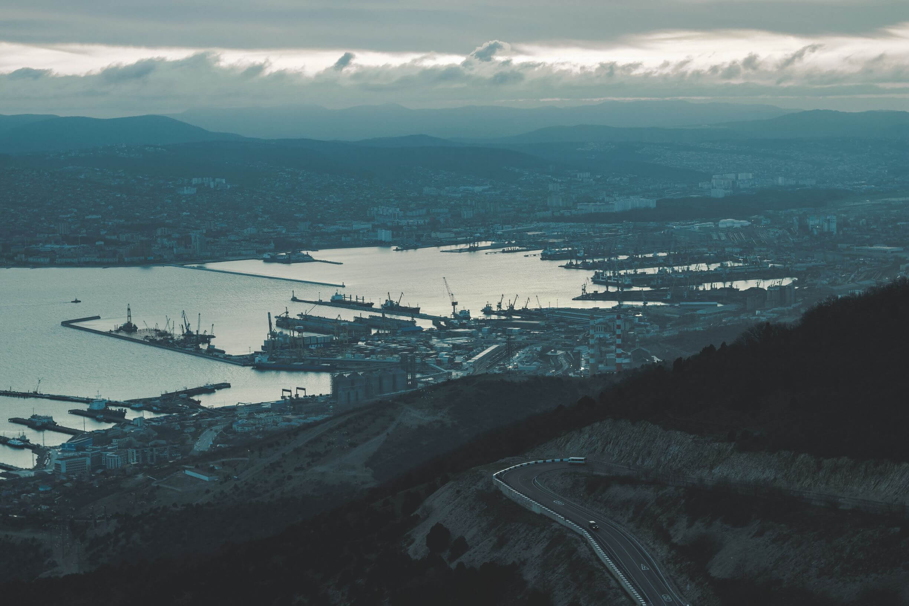

# Проект 4: Место :evergreen_tree::evergreen_tree::evergreen_tree:

### О проекте:
Одностраничный адаптивный сайт с возможностью менять имя и деятельность в профиле при помощи формы, всплывающей при нажатии на кнопку редактирования.

Использованные технологии и ПО:
* HTML, CSS, JavaScript
* Figma, VS Code
* BEM, Flex, Grid, DOM
------
:information_source:\
[Деплой](https://azmorigan.github.io/mesto/)\
[Макет](https://www.figma.com/file/UBc0t42LpJBOtdVS4RZLzj/JavaScript.-Sprint-4-(Copy)?node-id=0%3A1)
