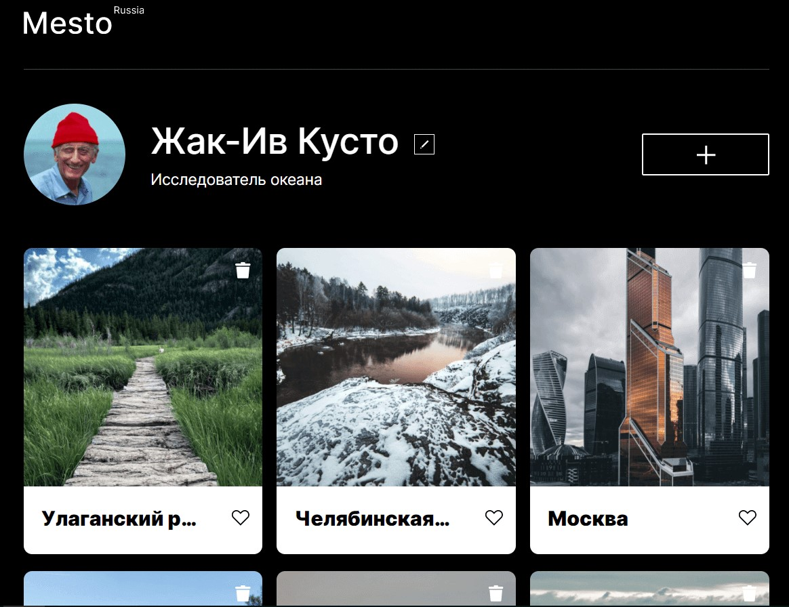

# Проект Место :evergreen_tree::evergreen_tree::evergreen_tree:
### О проекте:
Одностраничный адаптивный сайт о различных местах России. Веб-сайт интерактивный: можно поменять имя и деятельность в профиле, добавить карточку, удалить ее и открыть картинку в полном размере, ставить лайки картинкам. Присутствует валидация форм: идет проверка на тип вводимых данных и их длину. Закрыть все всплывающие окна можно с помощью клика на крестик, пространства вокруг попапа и кнопки esc.

Использованные технологии и ПО:
* HTML, CSS, JavaScript
* Figma, VS Code
* BEM, Flex, Grid, DOM
* ООП
* Webpack
------

**[Деплой проекта](https://azmorigan.github.io/mesto/)**\
\

